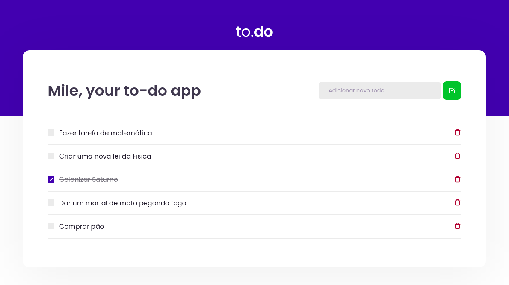

# Mile

## Estude e trabalhe de maneira organizada com um to-do simples e bonito!

<hr>

### Veja como é:

<p align="center">
  
</p>

<hr>

## Como executar na sua máquina e testar

<br>

### **Instalando e executando o projeto**

<br>

No terminal digite todos os comandos abaixo:

```Bash
git clone https://github.com/devzgabriel/ignite-mile
```

```Bash
cd ignite-mile
```

```Bash
yarn install
```

```Bash
yarn dev
```

### **Executando testes**

```Bash
yarn test
```

<hr>

## **Criado por Gabriel Silva durante o Ignite da Rocketseat!**
